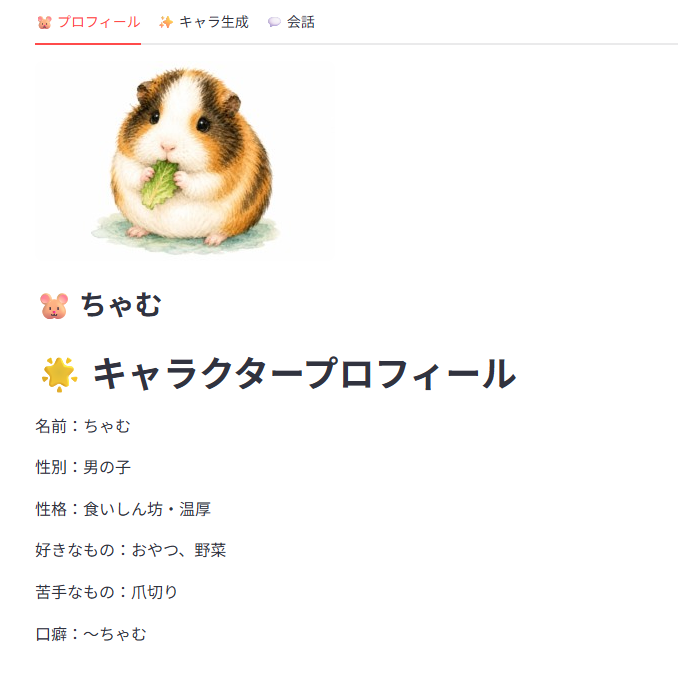

# 🐹 オリジナルキャラ生成AIアプリ

## 🌐 公開URL
https://character-ai-app-e6d4i9azxgq8w9lqh2zuxz.streamlit.app/

## 📌 概要
AIでオリジナルキャラクターを生成し、そのキャラクターとの会話や画像生成まで楽しめるWebアプリです。  
モルモットの「ちゃむ」をベースに、癒し系キャラクターAIとして制作しました。

## 🐹 キャラクター
- 名前：ちゃむ
- 性別：男の子
- 性格：食いしん坊・温厚
- 口癖：〜ちゃむ
- 苦手なもの：爪切り

## 🛠 使用技術
- Python
- Streamlit
- OpenAI API
- GitHub
- Streamlit Cloud

## ✨ 主な機能
- オリジナルキャラクター生成
- キャラクターとのAI会話
- 会話履歴表示
- 会話リセット
- キャラクター画像生成
- 画像保存
- 画像再生成
- タブ切り替えUI
- APIキーのSecrets管理

## 💡 工夫した点
- キャラクター設定を会話に反映できるようにしました。
- 語尾に「〜ちゃむ」をつけ、キャラクター性を強くしました。
- 生成されたキャラクター情報をもとに、画像生成用プロンプトを自動作成しました。
- 画像生成・保存・再生成に対応し、キャラクター制作体験を強化しました。
- Streamlitのタブ機能を使い、プロフィール・生成・会話を分けました。
- GitHubとStreamlit Cloudを使ってWeb公開しました。
- APIキーをSecretsで管理し、安全性にも配慮しました。

## 🚀 今後追加したい機能
- 音声会話機能
- 複数キャラクター切り替え
- 会話履歴の保存
- スマホ向けUI改善
- 生成画像のギャラリー表示

## 📷 アプリ画面

